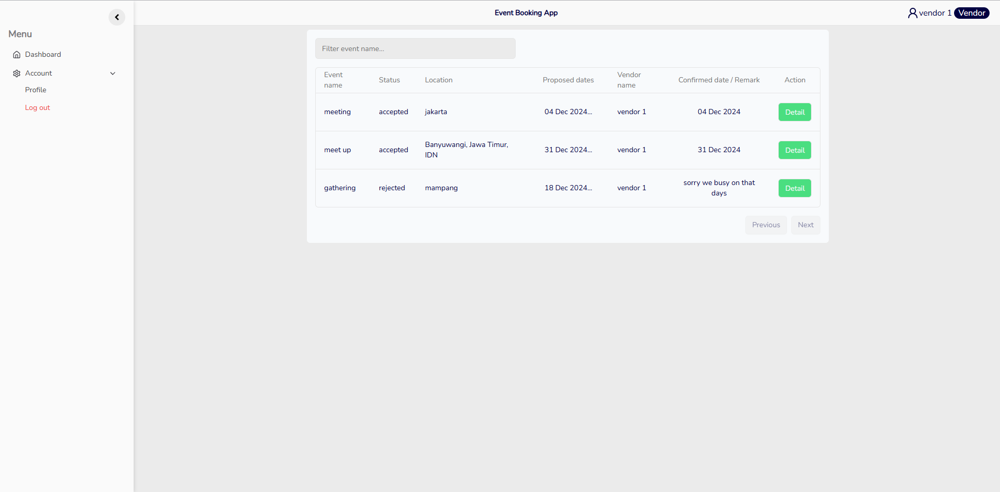
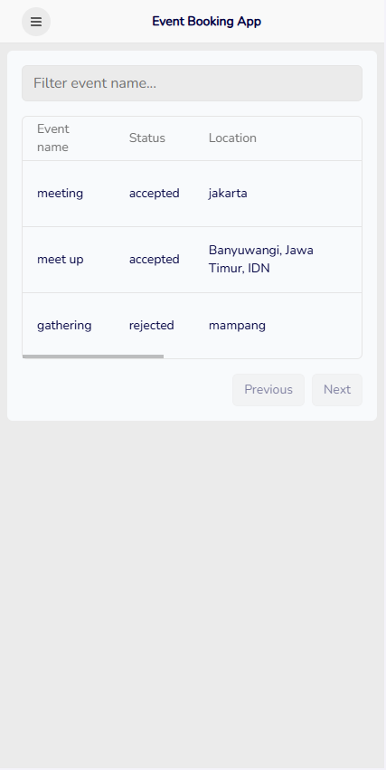
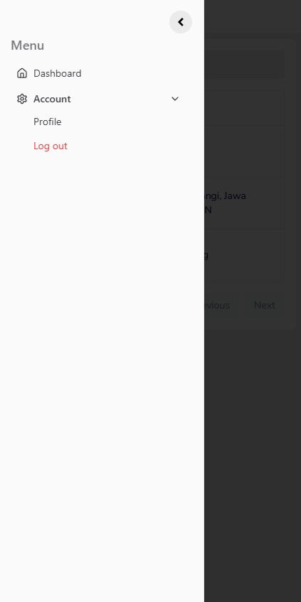

# Event bookind date

## Overview

The Event Booking System is a web application designed to facilitate event scheduling between HR personnel and Vendors. The application allows HR users to propose dates for events, which Vendors can then accept or reject. Built with modern technologies, this project leverages React, Zod for validation, Shadcn UI for user interface components, and Tailwind CSS for styling.

## Technologies Used

- **React**: A JavaScript library for building user interfaces.
- **Zod**: A TypeScript-first schema declaration and validation library.
- **Shadcn UI**: A component library for building user interfaces quickly and efficiently.
- **Tailwind CSS**: A utility-first CSS framework for styling.

## User Roles

### 1. HR User

- **Functionality**:
  - Propose event dates to Vendors.
  - View the status of proposals (accepted, rejected, pending).

### 2. Vendor User

- **Functionality**:
  
  - View proposed event dates from HR.
  - Accept or reject event proposals.
  - Provide feedback on proposals.

## Features

- **Event Proposal Creation**: HR users can create event proposals with specific dates and details.
- **Proposal Management**: HR can view and manage the status of their proposals.
- **Vendor Response**: Vendors can accept or reject proposals, providing feedback as necessary.
- **Responsive Design**: The application is fully responsive, ensuring usability across devices.

### Web appearance

- **Desktop**
  
  
- **Mobile**
  
   &nbsp;  &nbsp; 

## User for testing
- **HR** :
  name : hr company 1
  password : abc123
- **Vendor** :
  name : vendor 1
  password : abc123

## Installation

To set up the project locally, follow these steps:

1. Clone the repository:
   
   ```bash
   git clone https://github.com/RPrasetyoB/booking-event-client.git
   ```

2. Change folder:
   
   ```bash
   cd booking-event-client
   ```

3. Install dependecies:
   
   ```bash
   npm install
   ```
4. Make sure the Back end API running (booking-event-server)

5. Start the app:
   ```bash
   npm start
   ```
6. Client will running on https://localhost:5173
